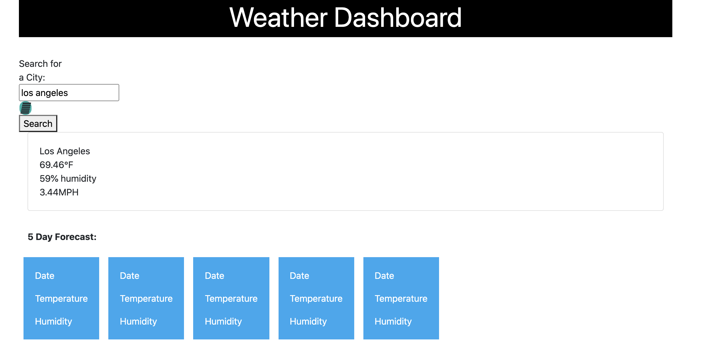

# weather-API-challenge

## Description
A weather dashboard that will run in the browser and feature dynamically updated HTML and CSS.

## Technologies

HTML, CSS and Javascript

## Screenshot

## Usage
As mentioned above The Tech Blog A CMS-style blog site. This site is for developers, where developers can post their blog posts and comment on other user's posts as well.

    

## License

